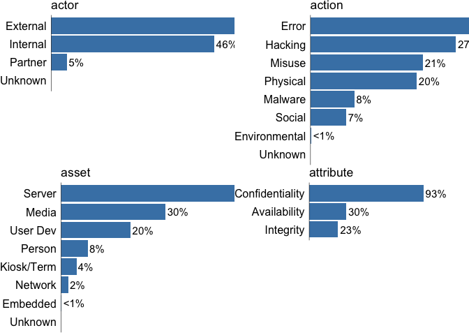
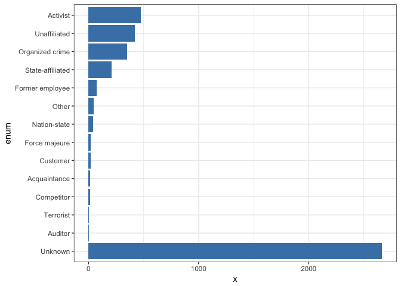
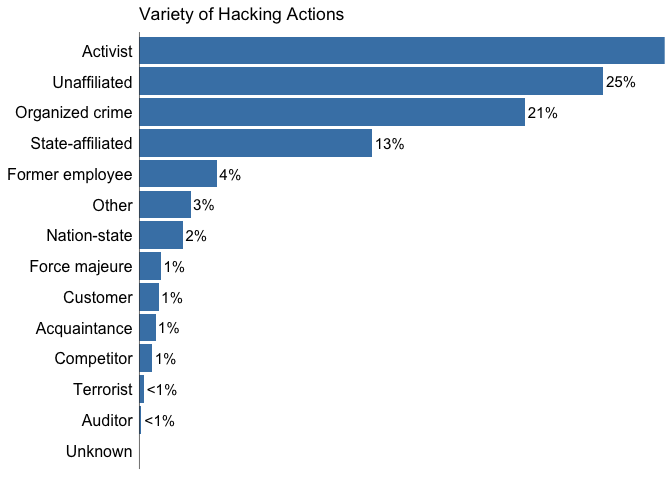
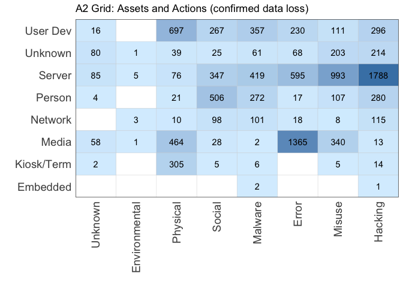

verisr
======

This package is to support data analysis within the VERIS framework (<http://veriscommunity.net>). It is intended to work directly with raw JSON and can be used against the VERIS Community Database (VCDB) found at (<http://veriscommunity.net/vcdb.html>) and (<https://github.com/vz-risk/VCDB>).

This package has two purposes. First is to convert one or more directories of VERIS (JSON) files into a usable object (in this version it is currently a data.table, but I hope to move to a dplyr object). Second, it offers a set of convenience functions for doing basic information retrieval from the object.

Install it from straight from github:

``` r
# install devtools from https://github.com/hadley/devtools
devtools::install_github("vz-risk/verisr")
```

To begin, load the package and point it at a directory of JSON files storing VERIS data.

``` r
library(verisr)
vcdb.dir <- "../VCDB/data/json/"
# may optionally load a custom json schema file.
if (interactive()) { # show progress bar if the session is interactive
  vcdb <- json2veris(vcdb.dir, progressbar=TRUE)
} else {
  vcdb <- json2veris(vcdb.dir)  
}
```

    ## [1] "veris dimensions"
    ## [1] 7833 2232
    ## named integer(0)
    ## named integer(0)

You can also use a vector of directory names to load files from multiple sources

``` r
library(verisr)
data_dirs <- c("../VCDB/data/json", "private_data")
veris <- json2veris(data_dirs)
```

What json2veris() returns is a plain data.table object, which enables you (the developer) to work directly with the data.

``` r
class(vcdb)
```

    ## [1] "verisr"     "data.frame"

``` r
dim(vcdb)
```

    ## [1] 7833 2232

There are several convenience functions to get a feel for what's in the current verisr object.

``` r
summary(vcdb)
```

    ## 7833 incidents in this object.

    ##       actor                action            asset     
    ##  External:3987   Environmental:   8   Embedded  :   2  
    ##  Internal:3546   Error        :2266   Kiosk/Term: 320  
    ##  Partner : 349   Hacking      :2078   Media     :2153  
    ##  Unknown : 210   Malware      : 633   Network   : 152  
    ##                  Misuse       :1604   Person    : 555  
    ##                  Physical     :1517   Server    :3587  
    ##                  Social       : 515   Unknown   : 636  
    ##                  Unknown      : 233   User Dev  :1431  
    ##                                                        
    ##            attribute   
    ##  Availability   :2347  
    ##  Confidentiality:7249  
    ##  Integrity      :1835  
    ##                        
    ##                        
    ##                        
    ##                        
    ##                        
    ## 

``` r
library(ggplot2)
plot(vcdb)
```



    ## TableGrob (2 x 2) "arrange": 4 grobs
    ##   z     cells    name           grob
    ## 1 1 (1-1,1-1) arrange gtable[layout]
    ## 2 2 (1-1,2-2) arrange gtable[layout]
    ## 3 3 (2-2,1-1) arrange gtable[layout]
    ## 4 4 (2-2,2-2) arrange gtable[layout]

Let's look for a specific variable by getting the data aggregated on a VERIS enumeration. In this case the variety of external actor.

``` r
ext.variety <- getenum(vcdb, "actor.external.variety")
print(ext.variety)
```

    ##                enum    x    n    freq
    ## 1          Activist  477 1676 0.28461
    ## 2      Unaffiliated  421 1676 0.25119
    ## 3   Organized crime  350 1676 0.20883
    ## 4  State-affiliated  211 1676 0.12589
    ## 5   Former employee   71 1676 0.04236
    ## 6             Other   47 1676 0.02804
    ## 7      Nation-state   40 1676 0.02387
    ## 8     Force majeure   20 1676 0.01193
    ## 9          Customer   18 1676 0.01074
    ## 10     Acquaintance   15 1676 0.00895
    ## 11       Competitor   12 1676 0.00716
    ## 12        Terrorist    4 1676 0.00239
    ## 13          Auditor    2 1676 0.00119
    ## 14          Unknown 2665   NA      NA

You can see this returns the enumeration (enum), the count of that enumeration (x), the sample size (n) of the enumeration class (external actor in this case) and the frequency (freq = x/n). From that, you could create a barplot with ggplot:

``` r
gg <- ggplot(ext.variety, aes(x=enum, y=x))
gg <- gg + geom_bar(stat="identity", fill="steelblue")
gg <- gg + coord_flip() + theme_bw()
print(gg)
```



or use a built-in function to do the same thing (but a little prettier).

``` r
print(simplebar(ext.variety, "Variety of Hacking Actions"))
```



Filters have changed
====================

The way filters are handled are different. The old function of getfilter() has been removed, it would just return a vector of logicals the same length as the verisr object which would indicate which records to use. Since you have the data (the verisr object is just a data.table) and all the enumerations are logical values, it should be trivial to create a filter. For example, to filter on all the incidents with confirmed data loss, and then further filter for hacking vector of web appliation...

``` r
# see the docs on data.table for getting columns like this
ddfilter <- vcdb[["attribute.confidentiality.data_disclosure.Yes"]]
webfilter <- vcdb[["action.hacking.vector.Web application"]]
# now we can combine with | or & ("or" and "and" respectively)
# to filter incidents with confirmed data loss and web vector:
ddweb <- ddfilter & webfilter
```

Since these are just logical vectors now, we can use sum() to see how many matches.

``` r
cat("Confirmed data loss events:", sum(ddfilter), "\n")
```

    ## Confirmed data loss events: 5076

``` r
cat("Hacking vector of web apps:", sum(webfilter), "\n")
```

    ## Hacking vector of web apps: 1028

``` r
cat("Both data loss and web app:", sum(ddweb), "\n")
```

    ## Both data loss and web app: 603

Special names added to verisr object
====================================

Most of the names to query are obvious from the schema. Things like "actor.external.motive" for example is relatively intuitive. But when the verisr object is created there are several more fields dervied from the data to make queries easier. Those are:

-   *actor* will return top level actor categories
-   *action* will return top level action categories
-   *asset.variety* will return top level asset categories
-   *attribute* will return top level asset categories
-   *victim.industry2* will return the first 2 digits of the NAICS code
-   *victim.industry3* same, first 3 digits
-   *victim.orgsize* returns "Large" and "Small" enumerations
-   *pattern* returns the patterns (see DBIR 2014) each line is classified as

If you come across any more that you'd like added, please reach out.

Querying Multiple Enumerations
==============================

One rather fun feature of the lastest version is the ability to query for an enumeration as it relates to one or more other enumerations. For example, if you wanted to create a A2 grid, which compares the action categories to the asset categories, it's a single query:

``` r
a2 <- getenumCI(vcdb, "action", "asset.variety")
a2$by <- sapply(as.character(a2$by), function(x) { 
  strsplit(x, split = '.', fixed = TRUE)[[1]][3]
  })
head(a2)
```

    ##       by     enum    x    n    freq
    ## 1 Server  Hacking 1788 3513 0.50897
    ## 2 Server   Misuse  993 3513 0.28266
    ## 3 Server    Error  595 3513 0.16937
    ## 4 Server  Malware  419 3513 0.11927
    ## 5 Server   Social  347 3513 0.09878
    ## 6 Server Physical   76 3513 0.02163

In previous versions there was a `getenum` and `getenumby` function for one enumeration or multiple enumerations respectively. However, as of version 2.1, `getenumby` is an alias to `getenum` and both calls have the same functionality.

And we can now just visualize that with ggplot in a nice 2x2 grid



    ##    user  system elapsed 
    ##  29.804   1.145  35.426
